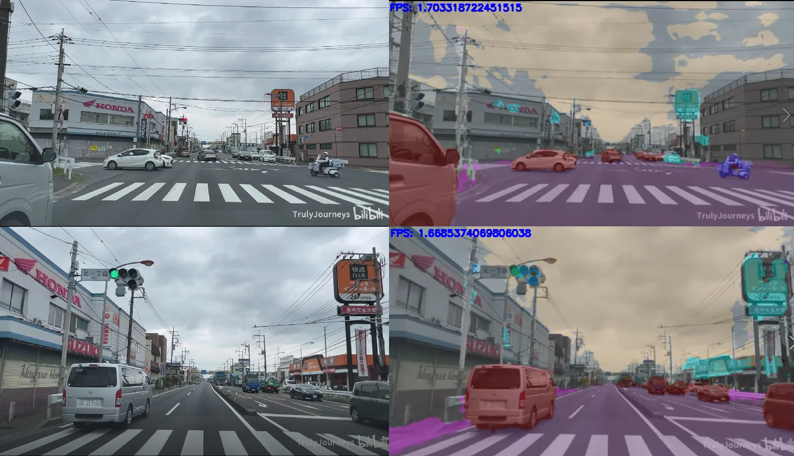
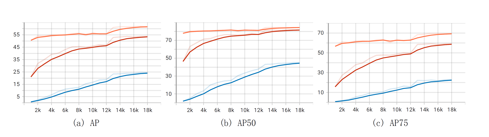
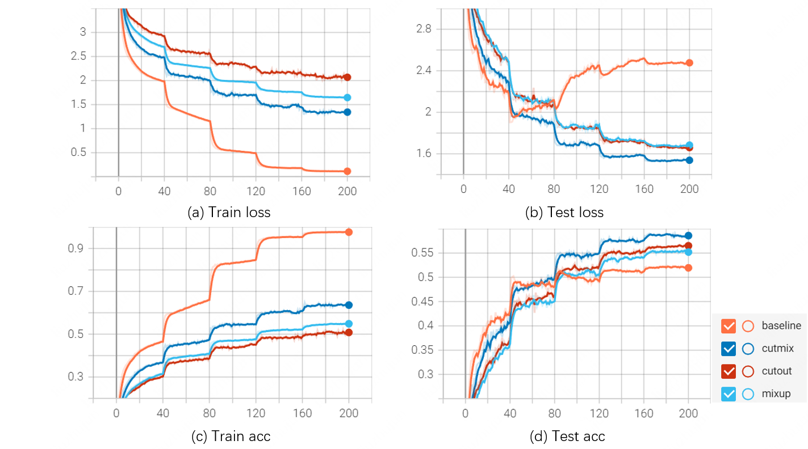

# 《神经网络与深度学习》期末项目

林恒旭 21210980049

刘竹君 21210980052

2022年6月12日

## 视频/模型下载地址

- [deeplabv3plus预训练模型和测试结果](https://pan.baidu.com/s/1APvkktgpLmWZdvfZQHXqng?pwd=j04c)
- [Faster R-CNN（COCO+ImageNet预训练、ImageNet预训练、随机初始化）](https://pan.baidu.com/s/1FMh7eBFnIl1_qaqWTZl3MA?pwd=a0nv)
- [ViT（baseline和三种数据增强）](https://pan.baidu.com/share/init?surl=i3huo8wXhqJ5GGcz10wSvw&pwd=tu42)

## 基于Deeplab v3+的语义分割

### 任务要求

使用在Cityscapes数据集上开源的任意一个语义分割模型，网络下载一段驾驶视频（类似行车记录仪视频），对视频每一帧进行测试并可视化，结果视频上传至网盘。

### 运行方法

1. 网盘下载[预训练模型](https://pan.baidu.com/s/1APvkktgpLmWZdvfZQHXqng?pwd=j04c)`./deeplabv3plus_cityscapes`，放在`./model` 文件夹

2. 测试视频放在`./video` 文件夹，提供了我们的测试视频`行车视频.mp4`，截取自[日本自驾4K60帧行车记录](https://www.bilibili.com/video/BV1aF411u7NY?spm_id_from=333.1007.top_right_bar_window_history.content.click)

   ```bash
   TEST_VIDEO_PATH = "./video/行车视频.mp4"
   ```

3. 运行程序，结果输出到`./result`文件夹

   ```bash
   python inference.py
   ```

### 分割结果



完整视频见[百度网盘](https://pan.baidu.com/s/1APvkktgpLmWZdvfZQHXqng?pwd=j04c)，视频路径为`./test_seg.avi`。

## 基于Faster R-CNN的VOC目标检测

### 任务要求

对Faster R-CNN模型，分别进行以下训练：

1. 随机初始化训练VOC
2. ImageNet预训练backbone网络，然后使用VOC进行fine tune
3. 使用coco训练的Mask R-CNN的backbone网络参数，初始化Faster R-CNN的backbone网络，然后使用VOC进行fine tune

### 运行方法

1. 转到目标检测文件夹

   ```{bash}
   cd object_detection
   ```

2. 重现虚拟环境

   ```{bash}
   conda env create -f environment.yaml
   ```

3. 下载VOC数据集，并放置在`datasets`文件夹下

   ```{bash} 
   # 下载
   wget http://host.robots.ox.ac.uk/pascal/VOC/voc2007/VOCtrainval_06-Nov-2007.tar
   wget http://host.robots.ox.ac.uk/pascal/VOC/voc2007/VOCtest_06-Nov-2007.tar
   wget http://host.robots.ox.ac.uk/pascal/VOC/voc2012/VOCtrainval_11-May-2012.tar
   # 解压
   tar xvf VOCtest_06-Nov-2007.tar
   tar xvf VOCtrainval_06-Nov-2007.tar
   tar xvf VOCtrainval_11-May-2012.tar
   # 移动
   mv VOCdevkit/VOC2007 datasets/VOC2007
   mv VOCdevkit/VOC2012 datasets/VOC2012
   ```

4. 训练模型（可修改配置文件路径）

   ```{bash}
   bash run.sh
   # 如果想要修改配置文件，可以在run.sh里修改 
   # --config-file ${IMAGENET_PRETRAINED}/${SCRATCH}/${COCO_PRETRAINED}
   ```

5. 可下载已经训练好的[模型](https://pan.baidu.com/s/1FMh7eBFnIl1_qaqWTZl3MA?pwd=a0nv)，并放置在`data`文件夹下

6. 模型结果可视化

   ```{python}
   # 在inference.ipynb中调用visualize函数
   visualize(<your config path>, <your inference directory>, <your title>)
   ```

### 训练结果

下表为三种模型的训练阶段AP变化情况，橙色曲线代表COCO+ImageNet预训练模型，红色曲线代表ImageNet预训练模型，蓝色曲线代表随机初始化模型。



## 基于ViT的CIFAR 100图像分类

### 任务要求

设计与期中作业1模型相同参数量的Transformer网络模型，进行CIFAR-100的训练，并与期中作业1的模型结果进行比较，可使用三种不同的数据增强方式。

### 运行方法

本次任务使用的ViT参数配置如下：

```python
v = ViT(
    image_size = 32,
    patch_size = 4,
    num_classes = 100,
    dim = 512,
    depth = 6,
    heads = 16,
    mlp_dim = 512,
    dropout = 0.1,
    emb_dropout = 0.1
)
```

- 运行baseline的命令：

  ```bash
  bash scripts/baseline.sh
  ```

- 运行cutout的命令：

  ```bash
  bash scripts/cutout.sh
  ```

- 运行mixup的命令：

  ```bash
  bash scripts/mixup.sh
  ```

- 运行cutmix的命令：

  ```bash
  bash scripts/cutmix.sh
  ```

### 运行结果

下表为四个实验的Loss和Accuracy变化情况：


